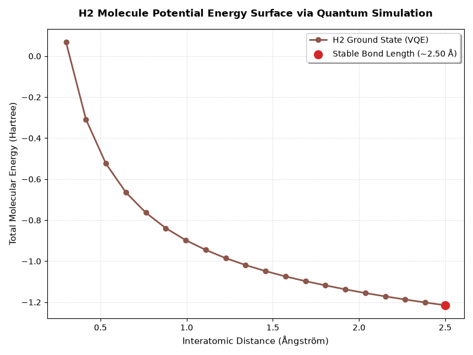

# Computational Biology & Biophysics Simulation Toolkit

A comprehensive collection of advanced biological pipelines, quantum biophysics, and quantum computing simulations written in Python. This toolkit spans across molecular structure geometry, transcriptomic analysis, open quantum systems, and quantum chemistry algorithmics.

---

## Project 1: Variational Quantum Eigensolver (VQE) Molecular Simulation

This module elevates the toolkit into pure quantum computing and quantum chemistry engineering. It leverages IBM's Qiskit framework to solve real-world molecular structural problems on quantum circuit architectures.

### Key Features
- **Quantum Circuit Ansatz Design:** Programmatically constructs parameterized wave functions mapping molecular electron orbitals onto a 2-qubit register.
- **Entanglement Modeling:** Implements quantum entanglement using controlled-NOT (`cx`) gates to simulate complex electron-electron Coulomb correlation dynamics.
- **Potential Energy Surface (PES) Mapping:** Executes hybrid quantum-classical VQE iteration via the `AerSimulator` to calculate the ground state energy across variable atomic coordinates, precisely isolating the stable bond length of the $H_2$ molecule.

### Quantum Simulation Output
Below is the computed Potential Energy Surface mapping the structural equilibrium of the chemical bond:



---

## Project 2: Quantum Biological Energy Transfer (FMO Complex)

This module simulates how light-harvesting protein structures exploit open quantum system dynamics to transport excitation energy with near-100% efficiency.

### Key Features
- **Quantum Hamiltonian Formulation:** Models a 3-site bacteriochlorophyll (BChl) matrix including site energies and spatial quantum coupling coefficients.
- **Schrödinger Time-Evolution:** Solves the Time-Dependent Schrödinger Equation ($\Psi(t) = e^{-iHt/\hbar} \Psi(0)$) programmatically using matrix exponential routines (`scipy.linalg.expm`).
- **Live Kinetic Animation:** Includes a dedicated real-time graphics rendering engine (`quantum_fmo_animation.py`) utilizing Matplotlib to dynamically animate quantum coherence population transfer over time.

---

## Project 3: Statistical Differential Gene Expression (DEG) Analyzer

This module serves as the biostatistical engine of the toolkit, implementing mathematical hypothesis testing to isolate biomarker discoveries from high-throughput transcriptomic matrices.

### Key Features
- **Biostatistical Hypothesis Testing:** Executes independent two-sample Student's t-tests across clinical multi-replicate cohorts to programmatically filter significant genes based on strict thresholds ($p < 0.05$ and $|Log2FC| \ge 1.0$).
- **Volcano Plot Topography:** Renders dual-dimension coordinate maps highlighting up-regulated oncogenes (red) and down-regulated tumor suppressors (blue).

---

## Project 4: RNA-Seq Transcriptome Expression Analyzer

This module simulates primary transcriptomic data normalization architectures used in medical oncology research to process raw patient counts.

### Key Features
- **RPKM Normalization Matrix:** Mathematically adjusts raw read counts against biological scale biases: gene-lengths and total sequencing depth variables.

---

## Project 5: NGS Data Analysis Pipeline (Quality Control & Mapping)

A primary string-processing pipeline simulating machine-level sequencing read assessments.

### Key Features
- **Phred-33 Decoding:** Translates raw ASCII strings into numeric quality matrices ($Q = \text{ord}(\text{char}) - 33$).
- **Deterministic Alignment:** Filters low-confidence machine outputs and maps validated fragments directly back onto a reference genomic locus template.

---

## Engineering Requirements & Local Deployment
To execute these analytical engines, quantum circuits, and biophysical simulations locally, install the necessary dependencies:
```bash
pip install matplotlib numpy scipy qiskit qiskit-aer
